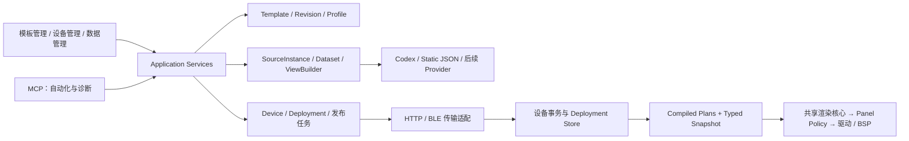

# 通用低功耗信息终端：渐进式总设计

日期：2026-09-21。状态：架构提案，未实现、未部署。本文件仅定义目标与迁移约束，不授权推送、OTA 或现场配置变更。

## 1. 结论与标记

推荐把产品组织为“模板资源 + 每设备 Deployment + 有界展示数据”的平台。Bridge 负责采集、映射、发布和调度；设备负责验证、保存、执行已编译模板、决定无线寿命和实际刷新。Codex 是一种 Provider，不能继续定义整个设备协议。第一版用 Codex 与 Static JSON 两种 Provider 验证边界，不先造插件平台。

全文标记约定：**Current** 是代码或交接记录支持的现状；**Target** 是本文推荐设计；**Assumption** 是需要验证的输入；**Deferred** 是明确延后。未特别标记的方案、字段、接口和流程均为 Target，不表示已有 API。当前行为与目标冲突时，迁移适配层保留旧设备行为，新能力必须显式协商。

核心原则：保存不发布；发布冻结内容；一个设备可安装多个模板但任一时刻只有一个 active；日常同步只使用 active 的 compiled requirement plan；数据提交、持久化、屏幕显示分别报告；模板没有无线、占用或刷新安全权限。

## 2. 当前事实与边界

| 证据 | Current | 设计影响 |
|---|---|---|
| `PROGRESS.md` 最新节 | 记录现场 0.15.9-bw、quad v12，设备 192.168.3.163，`rv2=0`；ROM SHA256 为 `47C641DF254449751DA6678F4503AA8276B527FCC3688DFABDA076024F9B8549` | 是交接记录，不是本次实时设备核验；AGENTS 概览 0.13.4/IP 已旧 |
| `src/main.cpp`、`template_engine.cpp` | `tplDraw` 每次解析模板与 usage，dry-run 后绘制；时钟引用与窗口已有加载期缓存 | 不把现有时钟优化误称为完整 compiled plan |
| `template_store.h/.cpp` | 内部 `TPL_STORE_MAX=4`；按 ID 文件，active 字符串；先 remove 再 rename 模板和 index；首份保存可设置 active | 不具有多资源断电原子发布保证；内部容量不等于产品 Profile 限制 |
| `core/profile.rs` | 有序 entry + enabled；最多 3 个启用；首个启用项默认；旧字符串 entry 兼容 | 3 是模板槽语义，不是设备数量；继续兼容 |
| `core/template.rs`、`template_xfer.cpp`、Python `tpl_canon` | schema 1、200×200、32KiB 上限、canonical JSON CRC32；固件核验传入字节 CRC、严格 type/font/bind | 固件当前不是通用 JSON 规范化器；发送端必须发送约定 canonical 字节 |
| `render/build.rs` | 编译同一 C++ template_engine、GUI_Paint、字体和 refresh_policy | 继续同源预览与固件逐像素对拍 |
| `refresh_policy.*`、`EPD_SSD1681.*` | 200×200/1bpp，区域类别/预算，BUSY 返回 bool，previous-plane 可信度；高墨变化保守全刷 | 先参数化再增加硬件，不能仅换宽高宏 |
| `core/runtime.rs/envelope.rs/http.rs` | Codex poller 直接生成共享 usage 信封、模板引用与 activity；HTTP 兼容 pull | 用适配层隔离业务信封与通用 Dataset |
| `core/activity.rs`、`app/main.rs` | usage 指纹与电源决策相连，pending template 以 ID 排队，再调用推送 | 改成每设备冻结发布对象，防排队期间文件编辑改变已确认内容 |
| `ble_bridge.*` | 既有 7 个特征；rv:2 分流/NACK 基座；`bleDeinit()` 调用 `NimBLEDevice::deinit(true)` | rv:2 入口存在不等于会合事务已完成；复用表优先 |
| `core/paths.rs`、`app`、`mcp` | portable data/seed；app 组织托盘、设备动作和 MCP，MCP 仍包含存储/推送实现 | 分离应用用例，UI/MCP 共享，而不是彼此调用形成环 |

现场已部署与工作区状态分开：最新交接记录声称 0.15.9 已 OTA 且存在未提交改动；本次只读源码，不通过版本字符串推定所有工作区文件已经部署。BLE 专项文档开头的 0.15.0 表格、power-state 早期“单模式”段落是历史，不能覆盖最新交接与后续章节。当前 quad v12 hash `430cc188`、照片验收、90 次时钟长测与 BOOT BLE 回归仍需按 PROGRESS 待办处理。

首版不追求跨设备原子事务、通用数据库、任意布局求解器或跨任意硬件的单一 ROM。

## 3. 领域模型与四标签



| 实体 | 含义与所有权 | 关系 |
|---|---|---|
| Template | 以逻辑 ID + target variant 标识的当前模板；库中只保留最新版 | 模板管理；保存直接替换当前内容，不提供历史版本选择 |
| Profile | 有序模板选择、enabled、默认规则的可复用集合 | 模板管理；只引用模板 ID，发布时解析各 ID 的当前最新版 |
| Device | Wi-Fi MAC 主键；名称/IP 是属性；能力、现场状态 | 设备管理；一台设备一个当前 Deployment 关系 |
| Deployment | 某设备的模板安装集、绑定、同步许可及期望/实况 | 设备管理；引用发布时冻结的 Profile 快照和设备专属绑定 |
| ProviderType | 内建采集适配实现及配置描述 | 数据管理；Codex、Static JSON 等 |
| SourceInstance | Provider 的一个配置实例与 credential_ref | 1:N Dataset；不绑定某个设备生命周期 |
| Dataset | 有类型的最新有效值、来源、质量、时间元数据 | 供多个 Deployment 引用；不是设备全量镜像 |
| ViewSnapshot | 一次构造的、仅含 active 所需字段的有界展示值 | 精确绑定 device/deployment/activation/requirements |

Profile 不包含设备 token 或 SourceInstance 密钥，也不决定 Wi-Fi/BLE。Deployment 明确保存每个安装项的 slot→Dataset/字段映射；只有 active 项参与同步。UI 在设备详情直接显示“使用的 Profile、当前模板、数据绑定、同步许可、期望与实际内容 hash”，不可把绑定藏在内部队列。模板页可跳转到使用它的设备，但不成为第二套设备状态。

顶层严格四个标签：**模板管理、设备管理、数据管理、MCP**。功耗是设备管理内的子菜单；MCP 展示连接、工具、权限与调用诊断，不创建第五个业务领域。

## 4. 模板、Profile、Deployment 与激活

### 4.1 当前模板、variant 与发布制品

schema 1 原始 ID/version 参与当前 canonical 内容，不改变旧 hash 算法；其中 version 只作为 legacy 协议兼容字段，由保存动作自动更新，不形成用户可管理的历史。schema 2 将逻辑 ID/alias 放库元数据，canonical 内容显式包含 schema 与 render target；相同内容资源可被多个 ID 引用。每个 target variant 只有一个当前最新版与预览；保存通过校验后直接替换当前内容，不提供历史列表、版本选择或模板回滚。200×200 不可自动缩放并宣称适配 400×300。将来可由 Bridge 离线编译布局到固定坐标，但编译产物仍须用户预览。

用户点击发布时，Bridge 把该时刻各模板 ID 指向的最新版 canonical 字节、compiled plans、资源与绑定冻结成一次性的 `ReleaseArtifact`。它仅保证排队、重试和多设备发送期间内容不漂移，不进入模板历史库，也不能在 UI 中被选择为旧模板版本。任务完成或过期且不再被任何设备任务引用后即可垃圾回收。

| 标识 | 覆盖范围与用途 |
|---|---|
| source JSON | 可编辑/可导出的安装源；不是日常执行格式 |
| canonical hash | 模板语义资源的规范字节身份；legacy 保留 CRC32，v2 采用带算法前缀 SHA-256 |
| DataRequirementPlan hash | 字段 slot/index/type/bounds、缺失/过期策略、本地需求及 compiler ABI 的确定性编码 |
| RenderPlan hash | 固定坐标 opcode、binding index、资源引用、region/clock 子计划、target 与 render ABI |
| resource hash | 图标、字体或计划等单个不可变资源实际字节的 SHA-256 |
| transport CRC | 一次传输 payload 字节的 CRC32；检测传输损坏，不提供身份认证或防恶意篡改 |
| Deployment manifest hash | 固定的安装资源集、顺序、绑定版本与默认 active 规则；不含运行计数/ACK |

legacy CRC32 相同不能独自证明内容相等：本地有内容时比较 canonical 字节；无源仅为 hash 候选。v2 新 hash 不替换 legacy 字段，不让旧设备读 SHA-256 当 8 位 CRC。

### 4.2 Deployment 结构

示意（hash 省略值不是实际可发布资源）：

```json
{
  "id": "desk-display", "device_mac": "70:04:1D:AA:BB:CC",
  "deployment_revision": "17", "profile_snapshot_hash": "sha256:...",
  "manifest_hash": "sha256:...", "origin": "published",
  "entries": [
    {"slot": 0, "template_id": "quota", "target": "bw200-v1",
     "artifact_hash": "sha256:...",
     "canonical_hash": "sha256:...", "requirements_hash": "sha256:...",
     "render_plan_hash": "sha256:...", "bindings": {"quota": "source1/limits"}},
    {"slot": 1, "template_id": "notice", "target": "bw200-v1",
     "artifact_hash": "sha256:...",
     "bindings": {"notice": "static1/message"}}
  ],
  "default_active_slot": 0,
  "sync_authorization": {"enabled": true, "min_display_interval_s": 60},
  "installed_manifest_hash": "sha256:...",
  "actual_active": {"slot": 0, "activation_generation": "6"},
  "last_error": null, "previous_manifest_hash": "sha256:..."
}
```

模型分为发布时冻结的 desired manifest 与可变 observed/status；示例合并展示，实际序列化 manifest 只包含本次发布内容。发布后按钮切换 active 不重写 manifest，而提交小型 ActivationRecord，引用 manifest + slot + 单调 activation_generation。所有安装项都唯一可定位，任何正常已配置状态恰有一个 active；无可用资源/出厂状态为显式 unconfigured，显示 ROM 恢复页，不能伪造 active。设备保留上一完整 manifest 只用于掉电恢复，不作为用户可选模板历史或产品级回滚功能。

继续提供旧 Profile 最多 3 个 enabled、首个默认的编辑与发布语义。设备能力可另报物理资源容量和可切换项容量；首版产品仍限制 3，不因内部 4 份文件自动开放第 4 槽。恢复读取若发现超过上限的清单，应在报告中完整列出并阻止直接生成 Profile，不能悄悄丢一项。

### 4.3 保存、发布、同步

保存直接更新模板库中的当前最新版，但不发布。点击发布时 Application Service 解析 Profile 引用的当前最新版，锁定模板字节/资源、各设备 variant、绑定配置和同步许可，生成一次性 ReleaseIntent 与每设备 job；排队后只读取这些 hash 对应资源。用户后来再次保存模板、Profile 或映射不会改变已排队任务；下一次发布直接使用新的最新版。

推荐默认：显式发布同时授权该 Deployment 持续同步 active 所需数据，确认界面展示节奏与来源；用户可暂停。恢复同步是单独动作，不重推模板。新设备、从设备恢复读取、仅保存、重新发现都不授予同步许可。暂停只停止以后投递，已提交的本地时钟/过期指示继续运行；正在提交的有界事务可能完成，UI 报告其结果。

## 5. 数据与运行计划

### 5.1 Provider 与时间语义

Provider 只实现配置验证、读取/订阅、规范化 Dataset、取消与有限退避。CodexAdapter 复用 app-server 恢复逻辑，保留 5h 不存在显示静态 100 且隐藏 reset、RC<=0 隐藏、无用户名整行隐藏的兼容映射。通用 renderer 不认识 Codex 桶名。Static JSON 第二 Provider 接收用户本地维护的有界值，用它证明无需启动 Codex 也能完成预览、发布、同步。

SourceInstance 保存 provider_type、config_revision、非敏感配置与 credential_ref；实际密钥在受保护的凭据后端，普通配置位于 `<exe>/data`。设备 token 与 Provider 凭据分开；模板、Snapshot、预览导出、日志不含密钥。HTTP JSON 后续限制响应大小、超时、字段路径和重定向；不把任意网络请求或脚本放进模板。

Dataset 对每次采集记录 `last_attempt_at`，成功记录 `last_success_at`；`observed_at` 是源数据实际观测时间，可未知；`valid_until` 是最后有效值的有效截止；`last_error` 是脱敏错误，失败不能删除最后有效值，也不能把旧值的有效截止延到当前时间。接触时间、服务器发送时间、源观测时间分别保存。

| revision | 变化条件 |
|---|---|
| source revision | 规范化有效值/源语义变化；相同值轮询不递增，来源原始版本可另存 |
| quality revision | 有效截止或质量状态变化；错误信息与 attempt 统计另有诊断序号 |
| deployment revision | 显式发布新的安装集或绑定/授权内容版本 |
| activation generation | 每次有效 active 切换，即使 A→B→A hash 相同也变化 |
| view revision | 针对一个激活上下文的展示包（值、可见质量/有效截止）变化；同包重试不变 |
| applied revision | 设备已交换的 ViewSnapshot；必须附 checkpoint durability |
| displayed revision | 最后成功波形对应的远程 view；本地时钟另用 local_display_seq |

view revision 使用 `(bridge_id, epoch, counter)`，counter 以十进制字符串编码，域内递增；跨 epoch 不比较大小，认证登记后才能切域。持久 epoch/counter 不能仅靠进程 RAM。刷新成功但无像素变化可标 `unchanged`，明确其 displayed revision 已与当前 view 等价。错误若不影响模板可见状态，只更新诊断，不虚增 view；续有效期需传输时可产生新 view，但像素不变仍零刷屏。不能复用 current activity 指纹（会剔除部分 reset 时间）作为全部通用数据相等定义。

### 5.2 模板声明和编译

```json
{
  "schema": 2, "render_target": "bw200-v1",
  "slots": {"notice": {"fields": {
    "title": {"type": "ascii", "max_bytes": 24, "required": true,
              "missing": "placeholder", "stale": "keep_with_marker"},
    "value": {"type": "int", "min": 0, "max": 100, "required": false,
              "missing": "hide", "stale": "hide"}
  }}},
  "local": ["clock.hhmm", "battery.percent", "connection.state"],
  "elements": [{"type": "text", "bind": "notice.title", "font": "f12",
                "x": 8, "y": 8, "region_class": "text"}]
}
```

字段可包括有限 bool/int/fixed-point/ASCII/epoch/枚举和有上限的小数组；单位、范围、最大长度是合同。禁止任意路径执行/递归对象/无界字符串，类型不合不做静默强转。required 意味着必须提供有效值或声明的确定性 fallback，并非网络失败时整个屏幕空白。所有分支引用（条件、可见性、格式化、过期标记）均纳入编译需求；未引用声明不需要远程投递。未识别 type/font/bind 全份拒绝。

设备安装阶段验证 canonical 源并调用共享 C++ compiler，得到：

1. `DataRequirementPlan`：稳定 field index、slot/type/bounds、required/fallback、freshness、本地字段 mask。
2. `RenderPlan`：有界指令数组、预解码图标、字体引用、字段 index、固定坐标、condition/format 操作、保守 refresh region 与 clock 子计划。

Bridge 用同一 compiler 得到同样的 plan hash，用于 ViewBuilder；设备自行生成或重新验证产物，不能信任 Bridge 指针/原生内存布局。序列化计划采用定义宽度/端序/长度/offset 的无指针格式，检查所有边界；不能 dump C++ struct 当跨 ABI 文件。资源路径规范化，不允许越界文件引用。

日常 BLE 会合、HTTP pull、局刷及正常 deep 唤醒只加载/执行已编译计划，不扫描 JSON 查需求。active 的远程需求是唯一日常集合；inactive 可存 plans/source，但不建立采集订阅。Bridge 对同一 SourceInstance 合并所有设备 active 需求，停用某模板不应停掉其他设备正在使用的源。

本地时间、电池、连接和功耗状态通过 LocalContext 注入，不从远程 Snapshot 接受同名覆盖。模板 region_class 只是保守提示，compiler 从黑底、图元覆盖、条件分支推导更严格类别；设备 panel policy 可升级全刷。模板无权选传输、renew lease、提高局刷预算。

### 5.3 一致 ViewSnapshot 与失效防护

ViewBuilder 在短临界区取得各 Dataset 的不可变引用，再释放锁构造完整候选；包内列出 source revision/observed_at 向量、assembled_at、每字段或 slot 的 valid_until 和 quality。这保证接收方一次应用，不能保证气象源与日历源同一时刻观测。可设 `max_skew_s`：超限时按模板策略标 mixed/stale、隐藏该项或延后有界一次；不无限等待最慢源，也不谎称分布式事务。

```json
{
  "protocol": 2, "device_mac": "70:04:1D:AA:BB:CC",
  "deployment_revision": "17", "activation_generation": "6",
  "active_template_hash": "sha256:...", "requirements_hash": "sha256:...",
  "render_plan_hash": "sha256:...",
  "view_revision": {"bridge_id": "host1", "epoch": "e1", "counter": "42"},
  "sources": [{"slot": "notice", "source_revision": "9", "quality": "stale",
               "observed_at": 1790000000, "valid_until": 1790000060}],
  "fields": [{"index": 0, "type": "ascii", "value": "Meeting at 10"}]
}
```

包头必须同时匹配已安装 deployment、active hash、requirements hash、render plan 和 activation generation，再比较 view revision。A→B 切换后 A 在途包在 BEGIN 与 COMMIT 都重新检查；A→B→A 也因 generation 不同被拒绝。不能只在网络接收时查一次。设备本地按钮切换串行提交激活，立刻使旧接收事务失效；通知/下次握手上报新的需求 hash，桥丢弃旧数据队列并重建 view。新 active 无匹配缓存则显示声明的缺失态，不能挪用旧模板字段。

设备离线按 RTC 校准时钟与 valid_until 判断过期；时间未知/回拨超容差时标 unknown，不能称 fresh。本地质量转变由编译的 deadline 索引调度，不重解析 JSON。推荐下次分钟唤醒执行过期呈现，UI 明示最多一个 tick 的延迟；需更严格截止的模板应被设备能力拒绝或单独评估唤醒代价。

### 5.4 首版载荷选择

| 模型 | 决策 | 理由 |
|---|---|---|
| Snapshot | 首版唯一展示传输，完整且有界 | 简单幂等、跨漏会合恢复、不依赖 patch 基线 |
| Command | 独立认证控制平面 | claim/激活/功耗/OTA 不能伪装数据字段 |
| Patch | Deferred | 有实际带宽瓶颈后再加 base revision、冲突和回退完整快照 |
| Event | Deferred | 提醒不能借快照假装 exactly-once；需独立确认/保留策略 |
| Timeseries | Deferred 通用协议；允许 Bridge 生成固定长度图表数组 | 设备不存历史数据库，不承担聚合查询 |

采集频率由 Source policy 决定；显示更新节奏由 Deployment 用户许可决定；投递时机由设备可达性/功耗决定；最终局刷/全刷由 Panel policy 决定。四者不能压成一个 interval。

## 6. 多硬件与 ROM target

| 层 | 负责 | 不负责 |
|---|---|---|
| Board BSP | 引脚、SPI/I2C、电源门、按键、电池、RTC、板修订检测 | 模板布局、数据源 |
| Controller driver | SSD1681/后续控制器命令、RAM plane、BUSY、窗口 | 决定业务刷新频率 |
| Panel configuration/profile | 实际 panel 型号、方向、波形、温度适用范围、previous-plane 规则、ghost 预算 | 由模板提高预算 |
| Render target | 尺寸、像素格式/stride、颜色/灰阶、字体/图元能力、render ABI | GPIO、无线租期 |
| Firmware target | BSP+驱动+panel profile+内存/分区+功能集合的可构建组合 | 自动适配所有板 |
| Protocol capability | 支持的 schema/ABI/事务版本/上限/导出能力 | 用版本字符串推断所有能力 |

Current 基准是 ESP32-S3/Waveshare 1.54英寸200×200黑白/SSD1681；板闪存 40MHz 要求继续留在对应 target。Assumption：NOTE4 类设备的 ESP32-S3、约400×300、SSD2683、PSRAM/RTC/NFC/音频均是待核实输入，未在本设计独立验证；不能据此实现引脚表或发布 ROM。需要原理图、面板型号/规格、分区/flash/PSRAM、屏幕方向、供电时序与真机验证。NFC/音频不作为首版核心接口。

推荐共享 C++ 核心，每 firmware target 独立 PlatformIO env 与 ROM。分辨率参数贯穿 renderer、GUI_Paint、diff、refresh_policy、窗口缓存与 FFI；彩色/灰阶 target 先定义像素合同与全刷路径，再谈局刷。SSD2683 名称不能证明残影优于 SSD1681，波形必须按具体 panel 组合实测。

OTA 包包含内嵌 firmware_target、允许 board revisions、partition_layout_id、image_size、digest、最低兼容 bootloader/store ABI。Bridge preflight 与固件接收端都验证，不能只看文件名；不兼容在写入前拒绝。当前 target 尚不识别这些字段时走清楚标记的 legacy 发布流程，不声称已有设备侧防错刷。Target 禁止自动向 legacy 推送任意新 target ROM。

双槽存在不等于自动回滚已验证：Target 要求 bootloader 支持 pending/confirm/rollback、首次启动自检后确认；若现有 bootloader 未配置该机制，标为人工恢复/USB 回刷能力，不能承诺断电自动回滚。存储升级在新槽确认前保留旧 manifest/ABI；不可逆迁移不得随普通 OTA 执行。

## 7. ROM 模块、内存与持久化

推荐模块边界是职责接口，不必立刻建立对应目录或库：

| 模块 | 主要接口/职责 |
|---|---|
| BSP + controller + panel profile | 硬件初始化/休眠、显示成功或失败、有限 BUSY 等待 |
| Template compiler/runtime | `compile(source,target)`、`render(plan,snapshot,local)`；不访问网络/存储 |
| Snapshot store | 有界字段索引验证、候选交换、checkpoint；不解释 Codex |
| Deployment store | 内容寻址资源、manifest、ActivationRecord、恢复与 GC |
| Update transaction | 接收/长度/CRC/权限/版本校验、串行 commit、ACK 状态 |
| Radio/power state machine | 所有无线开关及硬截止、owner 与 light lease 的独立状态 |
| Telemetry | 有界环、实际 checkpoint、失败原因；不存完整隐私载荷 |

推荐 flash 同时保留 canonical source 与可再生 compiled plans；运行只持 active typed snapshot + compiled binding/render plan。仅存 JSON 简单但重复解析、String/DOM 峰值与重绘成本高；仅存 compiled plan 无法可靠导出/ABI 重建。源作为冷路径恢复材料值得保留；计划被视为 cache，不是唯一真相。deep 后 PSRAM/普通 RAM 视为丢失。

内存准入按公式逐 target 计算：接收缓冲/流式窗口 + parser 峰值 + 编译指令/资源 + 新旧 typed snapshot + 帧/旧帧 + 无线栈余量；不可只算 JSON 文件长度。200×200 1bpp 单帧 5000B；假设400×300 1bpp 单帧15000B，两帧30000B，仍未计其他内存。安装可流式写临时资源并释放 JSON DOM 后渲染，避免保留源字符串、DOM、图标副本和双帧全部重叠。失败前检查空间与峰值，NACK 保留旧部署。

RTC 优先留 Activation/plan 标识、时钟小计划、旧窗口、ghost 预算、近期 snapshot（能容纳时）和 CRC，不假定放下完整旧帧。Current 交接记录的 RTC 6000B 余量是某次构建审计，不能当新 target 常量。正常 deep 唤醒从 flash 加载已编译计划；时钟快速路径用 RTC 小计划。冷启动、ABI 改变、计划 CRC 错误：验证源→离线重编→验证资源→恢复。该异常重建允许解析源，是显式 recovery 状态；不能把每次 deep 都标 recovery。源缺失且计划不可用则保持可恢复旧部署或 ROM 错误页，要求用户重新发布，禁止在线猜模板。

### 7.1 多资源提交

1. 检查事务权限、基准 manifest、目标兼容性、剩余电量/空间；每设备同时仅一个发布/OTA 事务。
2. 写内容寻址资源到新文件，逐个校验长度/hash并关闭、读回。旧引用资源不删除。
3. 编译校验所有项，生成下一代 manifest 与初始 ActivationRecord；写入非当前 A/B manifest 槽，含 generation、长度、CRC、资源 hash 与 commit marker。
4. 只有全部资源可读且 manifest 校验通过才完成提交标记；小型双副本 active pointer 指向新 generation。恢复时扫描两个 manifest 与指针，选择规则必须确定：有效指针优先；指针损坏时选最高完整已提交 generation；未提交候选绝不启动。
5. RAM 切到新安装集/active context；生成候选帧并执行刷新。保留上一有效 manifest 和其资源。
6. GC 仅删除当前、上一有效版本、待提交事务均不引用的资源；低空间时可拒绝发布，不能先删除上一有效版本凑空间。取消/超时只清未引用暂存。

这里要求验证底层 LittleFS/NVS 写入完成语义与断电行为；双文件名本身不证明原子。提交 marker 与 pointer 均需 torn-write 检测，资源完整性必须参与开机选择。当前 remove→rename/index 实现是迁移输入，不能包装后直接宣称上述保证。小型 ActivationRecord 同样双副本提交，包含 manifest hash；按钮磨损频率与持久化策略独立评估。

### 7.2 数据 checkpoint 与 ACK

日常 snapshot 优先 RAM/RTC 原子交换，按可配置间隔或显式 durable 请求做双副本 flash checkpoint，合并相同值避免每分钟写 flash；建议起始 checkpoint 间隔15分钟，属于待测默认，不承诺所有业务适用。空间不足的 RTC target 先声明 volatile，深睡前需选择 durable 或下次缺失态，不能报告 RTC 已保存。

ACK 分为两个维度：`durability=volatile|rtc|durable`，`execution=received|validated|applied|displayed|display_pending|display_failed|unchanged`。ATT Write Response 仅是收到；applied 不自动等于 durable；displayed 不证明掉电后仍记得该 revision。ACK 同时报 applied/displayed revision 与 checkpoint revision、boot_id。异常复位后以实际 flash checkpoint 为准，不能恢复 RAM 中的“已确认”计数。桥见回退便重发当前完整 view，不把数据回退误判为源版本下降。

## 8. Bridge 模块与依赖

先在现有 crate 内划职责，保留 core、ble、render、app、mcp 五个边界，避免为每实体造 crate。

`core` 中纯领域类型与规则（Template/Profile/Deployment、Dataset、revision、策略）不依赖 Tauri、btleplug 或 MCP。Application Services 组织保存、导入、预览、发布、绑定、同步、claim、OTA，通过小量接口访问 storage/provider/device transport。Infrastructure 实现 Codex client、文件/凭据、HTTP、BLE、设备发现；app 作为 composition root 注入依赖、运行任务和显示 UI。render 保留 C++ FFI，不访问设备；mcp 只做协议/schema/权限上下文到 Application Service 的映射。

实际放置可先是 core 子模块 + app 中应用协调器；如循环依赖明显再提取一个 application crate，不先拆 Domain crate/Provider crate 等。禁止 `core→app`、`domain→mcp`、`mcp→直接文件覆盖/HTTP push`。现有 MCP 推送实现逐用例搬到共享 service，旧工具名作为薄适配保留。

建议共享用例：SaveTemplate、SaveProfile、ObserveDeviceTemplates、PreviewDeployment、PublishDeployment、SetSyncEnabled、SelectActive、GetDeviceStatus、Claim/Release、RequestLight/Renew、InstallFirmware。所有写用例接收 device MAC、意图/请求 ID、用户授权范围；claim 是协议前置动作，不是模板发布授权。MCP 的 `profile_push` 等明确写工具可表达显式发布意图，read/validate/render/save 工具绝不触发它。

每设备串行 delivery actor（普通任务即可）负责发布/OTA/数据优先级；数据合并最新 view，ReleaseIntent 不可被“合并数据”替换。Provider 有独立取消、超时和退避，一个失败不阻塞所有设备。多设备共享适配器实行有界公平队列，错过 BLE 窗口留到下一轮，不延长设备窗口。

## 9. 关键流程

### 9.1 显式发布

```text
编辑/选择 Profile → 设备 target 与绑定检查 → 同源预览/缺失态预览
→ 用户发布（冻结 ReleaseIntent）→ 每设备 job
→ 等待可达 → MAC/能力/token/owner 校验 → 必要时 POST /claim
→ stage 缺少资源 → verify/compile → commit manifest → activate
→ typed snapshot apply → panel refresh → ACK/状态核对
```

初次发布可连同已冻结的首帧 snapshot，但需要到执行时检查其有效期；过期则构造绑定不变的新 view，不改安装资源。预览值与实际执行值可能不同，确认界面应说明预览时间。多设备 job 分别 pending/succeeded/failed/cancelled/unknown，允许部分成功；失败设备重试同一 release 内容，不回滚成功设备。需要修正时重新发布模板库当前最新版；上一 manifest 只供设备内部掉电恢复，不作为用户选择的模板版本。

### 9.2 从设备读取模板（恢复/迁移角落流程）

从设备取得模板不是模板管理主流程，只用于 Bridge 数据丢失、接管旧设备或诊断现场差异。正常流程始终是 Bridge 保存最新版后向设备发布。该角落流程是仅本地写入的观察用例，不调用一般“发现后同步”链：

1. 从用户所选 Device 的缓存或纯只读查询取得 MAC、能力、template 清单、slot 顺序、active、hash/版本；缓存导入注明 observed_at 与可能过时。设备睡眠时等待自然可读机会或使用缓存，不发 WAKE、claim、renew、template/usage。
2. 若设备宣告只读源导出能力，读取各源；legacy 不存在导出端点时查本地库候选，不把 Bridge 的 `/template` 当设备导出。没有源则建立 unresolved entry，记录原 ID/hash/slot/target-knownness，不能生成空 JSON 假装成功。
3. 对可得源执行 canonical/严格验证、完整 hash 检查；用 `(canonical bytes, schema, render target, compiler ABI compatibility)` 去重。相同 hash 不同 ID 可复用当前资源并保存 alias；legacy ID 嵌入内容导致 canonical 不同则不声称相同资源，可建立逻辑关联。相同 ID 不同 hash 标记冲突，要求用户明确选择“保留 Bridge 当前最新版”或“以设备内容替换当前最新版”，不能同时建立历史版本，也不能静默覆盖。target 或 ABI 不明不能跨 variant 去重。
4. 再读清单/active 对比观察前后 generation；legacy 无 generation 则比对 hash/顺序/active，两次不一致有限重试后输出 inconsistent report，不宣称一致导入。
5. 用户明确选择“从设备恢复为 Profile”时，才在本地创建新的 Profile 与 `origin=observed` 的 DeploymentBaseline，保留原 slot 顺序以及 observed_active 独立字段。Profile 的正常首个默认规则不改：以后点击发布默认明确展示“保留观察 active”选项；不能为了 active 在第2槽而悄悄重排。
6. 报告 resolved/reused/alias/conflict/unresolved/unsupported、观察时间与 active；无论全成功与否均 sync_authorization=false，不自动重推、不刷屏、不改active、不claim。缺源的项可被保留和查看，阻止发布直到用户补源或显式移除。

若清单超3项，完整 observed inventory 只保留在本次恢复报告中，生成 Profile 前要求用户裁剪；不把第4项误当设备。为证明无写入，测试注入 transport spy，允许列表只有 read status/export；自动发现、contact/activity 副作用也需隔离。

### 9.3 本地切换与同步

按钮切换按安装顺序循环（当前2秒切模板语义保留），原子更新 ActivationRecord；刷新候选使用该项本地缓存或缺失态，增加 generation、作废旧事务、发送需求标识。桥仅更新 observed active，不自动“纠正”回默认；只有显式新发布/切换命令可改变。持续授权覆盖已发布的安装项及其冻结绑定，故按钮切换后新 active 可继续同步，不额外推模板。

每日同步流程为 active plan → Provider cache → 有界 ViewSnapshot → 校验当前上下文 → transport → commit → 本地 refresh。中间版本可丢弃，只要发送最新完整快照。Display failed 保持 applied 状态并安排本地安全全刷修复，不能反复提交相同数据来撞屏幕。

### 9.4 功耗子域

目标采用分钟 deep 时钟 + 短 BLE 会合；现行 legacy Wi-Fi pull 作为兼容分支保留：

```text
DEEP → RTC tick → compiled clock plan → BLE rendezvous
  ├─ 无指令 / NOOP / 超时 → 完整 radio deinit → DEEP
  ├─ 小 ViewSnapshot → 验证/原子应用 → ACK → radio off → 显示完成 → DEEP
  └─ WAKE_LIGHT(lease_s) → ACK → BLE deinit → Wi-Fi → LIGHT
BOOT → LIGHT(default 300s)
LIGHT → 显式 RENEW_LIGHT 或 lease 到期 → 有界收尾 → DEEP
```

owner lease 与 light lease 分开存储/计时：owner 控制谁可写，light 控制无线在线多久。仅 `POST /claim` 创建/转移 owner；BLE 普通数据不能 claim。owner 过期时桥需要认证 WAKE_LIGHT 得到 HTTP 机会，再显式 claim；WAKE 本身不是占用授权。有效他人 owner 不写，冲突不静默抢占。普通读取、claim、相同 revision、数据更新、保存、接触统计不续 light；只有新显式 renew 请求续租，重放 request_id 返回原截止。

建议起始硬限：BLE 初始化2s、广播1.5s、加密/首命令3s、事务8s、总radio15s；Wi-Fi建连15s计入 lease；BOOT默认300s；模板事务30s、OTA180s且有停滞截止。均属待测配置默认，设备强制总上限，不能分片重连重置。到期不接新事务；已开始事务仅允许预定有限收尾，display 可在 radio off 后完成，ACK 报 pending。低电保护优先；每条退出路径释放所有 PM 锁并完整 deinit，失败由有界 watchdog 恢复到安全 deep，不复位常开循环。

Bridge 保持事件监听优先，但 Windows 被动扫描可用性、广播可见性、加密耗时与多设备竞争均待测；错过窗口不自动切 Wi-Fi。模板/OTA/大包先经显式有界 WAKE_LIGHT，不能让模板字段改变电源策略。旧 activity 的自动升 light 仅留在 legacy 分支，v2 不消费其 mode 暗续租。

时钟 ghost budget 独立，previous-plane 不可信、BUSY 失败、极性/大黑量变化、未知区域均升级全刷；保留当前高墨保守门槛，照片验收后再按具体 panel 开放。每次波形成功才更新旧帧与预算。时钟预算到期应能用本地 plans/snapshot 全刷，无网络不强迫开 Wi-Fi。连接图标1Hz等行为是设备/panel profile 的受限本地显示策略，不是模板无限刷屏指令。

## 10. 协议、身份、安全与兼容

能力握手至少包含 firmware_target、board_revision、panel_profile_id、render_target、template_schemas、compiler/render ABI、snapshot_versions、max_template/resource/snapshot bytes、max_fields、max_active_entries、export_source、atomic_manifest、checkpoint levels、power_protocol。能力是双方交集，缺字段按 legacy 保守处理；未知 schema/ABI 不试发。

复用当前 GATT UUID/属性，版本化控制在既有 control、data、status 通路；不能仅凭首字节猜新旧模板分片。协商后采用 BEGIN(length/CRC/context/request_id)→连续offset CHUNK→COMMIT；分片不得超 MTU-3，乱序/重叠内容不同/越界取消。相同 revision 内容不同报 conflict；重复完成包幂等 ACK，不重刷不续租。读取/通知敏感 status 需在应用层检查 bonded+encrypted，不能因特征为 READ/NOTIFY 就公开上次结果。若确需改 GATT 表，独立版本迁移、测试 Service Changed，必要时明确解除配对再配对。

Wi-Fi MAC 是主键，名称、BLE地址、广告短摘要均不是认证凭证；IP→UDP→ARP→BLE 的发现结果都必须核实 MAC。原有 token 门控 `/update`、`/doUpdate`、ArduinoOTA、`POST /claim` 不变。新增资源提交/激活/功耗控制必须验证相应设备凭据与 owner；日常 HTTP/BLE 数据沿用受保护的 bridge 身份通道并核验匹配 owner，不以 hash 代替鉴权。周期 BLE 不开放新配对；新绑定保持物理操作流程。

普通运行数据仍在 `<exe>/data`，种子 `<exe>/seed`/开发只读回退。凭据不入仓库/日志；对请求 URL、异常链及 headers 统一脱敏。PROGRESS 已记录历史 token 日志风险，属于需单独修复/轮换的已知事项，本设计不复制任何 token。

schema 1 用 LegacyCodexAdapter 提供旧信封与 bind；schema 2 不混入旧解析器。新桥配旧固件继续旧 HTTP/模板语义并显示“非原子发布”限制；旧桥配新固件默认 legacy，用户显式启用新 Deployment/功耗能力后才切换。新协议暂时失联不等于对端不支持，不因漏一轮会合自动永久改模式。BOOT 仍提供恢复入口。模板保存替换库中当前最新版，但不能改写已经冻结的在途 ReleaseArtifact 或设备上已安装内容；只有下一次显式发布才更新设备。

## 11. 失败模型与恢复

| 失败阶段/反例 | 恢复与可观察结果 |
|---|---|
| A 切 B，A 数据在途；A→B→A | generation + hash/plan 在 COMMIT 再验证，拒旧包；只保留新 active 队列 |
| 源失败但旧值可显示 | 保留最后有效值与原 valid_until；按 stale 策略显示，last_error 独立 |
| 多 slot 时间不一致 | 快照带观测向量/skew；标 mixed 或按规则降级，不隐藏时间差 |
| 安装 schema/target 不支持 | staging 前拒绝；旧 manifest 保留，不自动缩放或剔除未知元素 |
| 导入源缺失 | unresolved 占位、报告不可发布；不伪造成功 |
| 冷启动计划 ABI/CRC 无效 | 从本地源重编；失败回上一部署/ROM 恢复页，标 checkpoint |
| 资源写入中掉电 | 临时/未引用资源忽略；当前 manifest 完整可启动 |
| manifest 写入/提交标记/指针切换掉电 | 校验两代和资源完整性，按确定性选择恢复；无半套资源 |
| commit 后刷屏前掉电 | 安装可已生效，displayed 未知；恢复从 checkpoint 全刷，不谎报显示成功 |
| 波形中掉电或 BUSY 超时 | previous-plane invalid；下次全刷，不沿用局刷预算/旧图假设 |
| ACK 丢失/ACK后掉电 | 查询实际 durable checkpoint；同包幂等或重发完整 snapshot |
| 批量发布仅一台成功 | 每设备结果保留，失败项重试/取消；不冒充批量事务 |
| owner 冲突/token 401 | 停写，显示占用/需要认证；不自动强制接管 |
| Wi-Fi升档失败/PC关机 | 有界关radio，保留队列/本地最后值，下次会合 |

遥测按设备记录 boot_id、manifest/activation/plan、applied/displayed/checkpoint、source freshness 摘要、事务结果、queue age、owner剩余、light剩余、radio-on/截止原因、ghost预算、previous可信度、BUSY/清理失败。读取状态不改变同步许可/功耗期限。日志是有界环与脱敏摘要；“预期deep”“错过会合”“确认故障”分别显示。电量估算与电流仪实测分列，未测不能报告续航天数。

## 12. 四标签用户流程

1. **数据管理**：创建 Codex 或 Static JSON SourceInstance → 测试读取 → 查看字段、类型、最后成功/观测/过期/错误；保存字段映射。凭据只显示引用与可用状态。
2. **模板管理**：选择/编辑模板当前最新版，选择目标 variant，预览正常/缺失/过期/边界数据；组合有序 Profile。模板不显示历史版本或回滚入口。
3. **设备管理**：选设备 → 选 Profile → 为各项 slot 绑定 Dataset → 查看当前 active 与发布后默认 active → 预览该设备 target → 显式发布并授权同步节奏。批量列表逐台展示成功/等待/失败。
4. **设备管理**的 Deployment 面板：持续同步/暂停、已安装与当前最新版差异、按钮切换后的实况、重试/取消/重新发布最新版；**功耗子菜单**显示 lease、会合与刷新预算，提供明确控制动作。读取设备模板位于恢复/诊断入口，不占模板管理主界面。
5. **MCP**：显示与上述同一用例的工具、请求/结果/诊断；agent 保存模板不会发布，显式 publish 工具接受冻结预览的引用与目标设备，错误与 UI 一致。

模板/Profile 页展示“最新版有未发布修改”而不是自动追踪推送。设备页展示“已安装内容不是当前最新版”“数据过期”与“数据已应用但显示失败”，不能统一叫同步失败。

## 13. 渐进迁移与准入

| 阶段 | 交付 | 准入/兼容 |
|---|---|---|
| M0 固定基线 | 当前 ROM/模板/协议 fixture、像素与状态语义测试；记录遗留限制 | 不改现场；恢复流程可操作 |
| M1 应用用例与冻结队列 | 抽出 UI/MCP 共用保存/发布服务；每设备 identity/config/job；队列保存内容 hash | legacy 仍可用；排队编辑不变包；token/claim回归 |
| M2 第二 Provider | CodexAdapter + Static JSON、Dataset、revision/freshness、四标签导航 | Static JSON 独立预览；legacy Codex 输出逐字段兼容 |
| M3 编译核心 | schema1 编译兼容层、schema2 slots、DataRequirementPlan/RenderPlan、target参数 | 共享C++逐像素一致；计数证明日常路径不解析JSON；未部署前测峰值 |
| M4 Deployment store | 内容寻址资源、双manifest、ActivationRecord、typed snapshots/checkpoint | 断电注入通过；旧store只读迁移/保留回退，不就地覆写 |
| M5 通用同步与恢复读取 | active-only ViewBuilder、设备恢复读取/冲突报告、持续授权与暂停 | 旧包拒绝、恢复读取零设备写、多个slot/设备故障隔离 |
| M6 BLE功耗协议 | 原子小快照、独立light lease、总截止、Windows调度 | 延续专项已完成显示基座；新协议默认仍需小规模实测后启用 |
| M7 第二硬件 | 核实NOTE4输入、独立env/ROM、panel profile/variant | 全刷先通过、OTA防错、照片/功耗验收后开放局刷 |

M3/M4 可在主机完成后才进板端；M2 的 Static JSON 可先只在预览证明域分离，到 M5 才给新协议设备投递。不能为了让旧固件显示任意数据，把通用字段塞进 Codex bucket 冒充兼容。M6 与通用平台共享事务核心，不另写第二套原子性/ACK；BLE专项的阶段编号不能替代本表的平台准入。

保留模块：Codex客户端恢复、identity/discovery、token/owner、transport基础、字体/GUI_Paint、SSD1681驱动、refresh policy思路、render FFI、portable paths。使用 anti-corruption layer 的模块：envelope/bind映射、legacy HTTP usage、activity 电源 hints、旧 profile ID、旧 store/status、旧 MCP工具。高风险点：main.cpp 串行状态与回调交叉、template compiler语义、像素格式/窗口方向、原子存储、owner与power分离、MCP/app依赖倒置。每个阶段独立开关和测试，不大爆炸重写。

## 14. 测试与验收矩阵

以下是验收要求，不表示本设计阶段已执行代码测试。

| 层 | 用例 | 通过标准 |
|---|---|---|
| 三方合同 | canonical键序/数字/字符串、CRC；未知type/font/bind；schema迁移 | 固件/Rust/Python golden相同；非法整份拒绝，legacy hash不变 |
| 编译与像素 | legacy模板、schema2边界/条件/ASCII/缺失/过期；各target | 同C++宿主/固件帧逐像素一致；预览默认battery=75显式标示 |
| 运行性能 | 千次会合/pull/局刷/deep；有效与损坏plan | 正常路径template JSON解析计数0；损坏仅一次受控恢复；峰值/时延达target预算 |
| 数据质量 | 同值轮询、失败旧值、续valid_until、时钟未知/回拨、多slot skew | revision各司其职；过期可本地判断；无伪fresh |
| 激活竞争 | A→B、A→B→A，BEGIN前/COMMIT前切换 | 旧包无应用/刷屏；active恰一个 |
| 发布冻结 | deep排队后编辑模板/Profile/映射；取消/重试 | 资源字节不变；重试同release，编辑只影响下次发布 |
| 恢复读取 | 同hash异ID、同ID异hash、缺源、variant/ABI未知、清单变化 | alias/conflict/unresolved正确；无claim/WAKE/usage/template/active写 |
| 存储故障 | 每资源写/manifest/marker/pointer/GC阶段断电 | 恢复完整旧或新版本；不组合半套；上一有效版本受保护 |
| ACK恢复 | volatile/RTC/durable提交、波形失败、ACK丢失、冷复位 | 报告实际checkpoint，重放幂等，displayed不虚报 |
| 安全 | 错MAC/token/owner、未bond/未加密、未知capability | 全部拒绝越权，无隐式claim、日志无凭据 |
| 功耗 | BOOT300s、读取/claim/同值轰炸、renew重放、所有退出路径 | 无显式新renew不延长；所有radio硬截止内关断，PM锁释放 |
| BLE/多设备 | MTU23/正常MTU、断片/越界、PC睡醒/漏扫、并发设备 | 事务有界、公平重试；报告机会命中率/P95，不宣称100%发现 |
| 面板 | 高墨/极性/时钟90次、deep2h/24h、BUSY失败 | 预算独立、未知基线全刷、照片合格；软件像素测试不能代替画质 |
| OTA | 错target/partition/board、断电、首次启动失败 | 写前拒错；可验证回滚或明确人工恢复限制 |
| UI/MCP | 同意图、同device、同失败条件 | 同服务/校验/结果；四标签，功耗仅设备子菜单 |
| 批量/legacy | 一台离线一台成功，新旧桥固件组合 | 部分成功可见，兼容明确，无静默新协议启用 |

功耗验收用同场景电池端积分测量比较 legacy 与新方案，包含底流、时钟、BLE初始化/加密/关闭、Wi-Fi/全刷与恢复成本。参数定值依赖实测；照片固定机位/曝光/光照，以同面板全刷参考比较黑块和残笔。

## 15. Keep / Change / Defer 与待决策

| Keep | Change | Defer |
|---|---|---|
| MAC主键、token/claim、安全边界 | Codex从协议中心变Provider | 任意脚本、通用插件加载器 |
| 3项Profile与单active、按钮切换 | 当前最新版+发布快照/每设备Deployment | 模板历史版本库与模板回滚UI |
| 同源C++渲染与ASCII净化 | JSON安装期编译，typed运行快照 | Patch/Event通用传输 |
| SSD1681安全全刷、独立clock预算 | target参数、BSP/panel边界 | 约束布局、自动缩放适配 |
| portable data/seed、显式推送 | 应用用例共享、冻结队列、恢复读取 | 多设备分布式原子事务 |
| legacy可回退 | 双manifest/checkpoint、显式light lease | 通用历史库、NFC/音频业务、面板双相实验 |

Decision Required（不阻塞保守实现）：

- NOTE4实际硬件与panel参数：推荐在核实前只做target接口与模拟尺寸测试，不交付该板ROM。
- 日常数据掉电保留保证：推荐默认RTC/定期durable，UI展示可能回退到checkpoint；需要每次durable的部署单独启用并验证flash寿命/功耗。
- 从设备恢复Profile后的active：推荐保留独立observed_active，后续发布确认默认保留它；新建Profile仍首个默认，任何改变都可见。
- 授权持续同步：推荐显式发布默认勾选且清晰显示、随时暂停；不把导入或claim视为同意。
- 更大槽数、彩色/灰阶、通用提醒：先保持3项和黑白最小协议，有第二个真实需求后再扩展能力。
- 新OTA包真实性：hash只保证完整性，推荐后续引入签名发布；无签名时仍必须token与target校验，不声称供应链认证。

本设计的最小成功标准是：同一 Bridge 可管理两台设备及两种 Provider；每台只有一个 active 所需的有界数据在同步；当前最新版发布快照可重试、恢复读取不碰设备；旧 Codex 设备继续可用；每条功耗路径都有设备端硬截止；不同 target 不会互刷 ROM 或误用模板。
